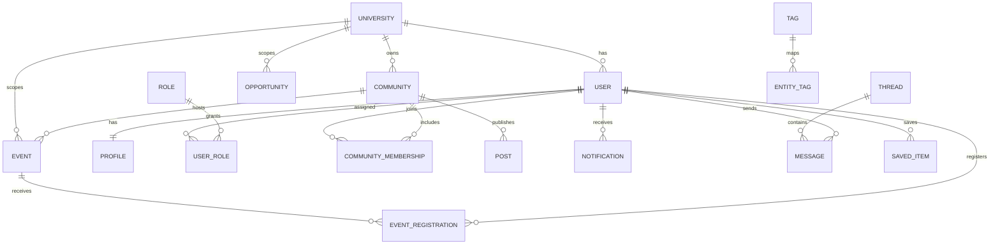

# Cirqles Database Specification

> This document defines the relational model and supporting data structures for Cirqles.
>
> It explains the purpose of each entity and how the domain fits together.

---

## 1. Database Principles

- Model the university tenant explicitly.
- Keep core entities normalized.
- Use append-friendly tables for audit, moderation, and logs.
- Index by real lookup and filter patterns.
- Separate identity, content, interaction, and operations data.

---

## 2. Core Entities

### University

Purpose: Represents a tenant or institution in the Cirqles ecosystem.

Why it exists: Everything must be able to scope to one university or span multiple universities safely.

Key relationships:

- Has many users
- Has many communities
- Has many official announcements
- Has many verification workflows

Indexes:

- `slug`
- `status`

### User

Purpose: Stores the base authenticated identity.

Why it exists: The platform needs a canonical identity for login, permissions, and activity ownership.

Key relationships:

- Belongs to one or more universities depending on policy
- Has one profile
- Has many memberships, registrations, notifications, and messages

Indexes:

- `email`
- `username`
- `primary_university_id`

### Profile

Purpose: Stores user-facing profile information.

Why it exists: Identity and presentation should be decoupled from auth.

Key relationships:

- Belongs to one user

Indexes:

- `user_id`
- `visibility`

### Role

Purpose: Defines permission tiers.

Why it exists: Authorization must be explicit and auditable.

Key relationships:

- Many-to-many with users through `user_roles`

Indexes:

- `slug`

### UserRole

Purpose: Junction table assigning roles to users.

Why it exists: Users can have more than one role.

Key relationships:

- Belongs to one user
- Belongs to one role

Indexes:

- `user_id`
- `role_id`

### Community

Purpose: Represents a group, club, circle, or campus community.

Why it exists: Communities are first-class in Cirqles.

Key relationships:

- Belongs to a university or global scope
- Has many memberships
- Has many posts
- Has many events

Indexes:

- `slug`
- `university_id`
- `visibility`

### CommunityMembership

Purpose: Tracks membership and member roles inside communities.

Why it exists: Joining, leaving, moderation, and membership status need explicit state.

Key relationships:

- Belongs to one community
- Belongs to one user

Indexes:

- `community_id`
- `user_id`
- `membership_status`

Constraints:

- Unique `(community_id, user_id)`

### Post

Purpose: Stores community posts, announcements, and feed items that originate from communities or official sources.

Why it exists: The feed needs a flexible content layer.

Key relationships:

- Belongs to one community or official source
- May reference media and tags

Indexes:

- `community_id`
- `post_type`
- `published_at`

### Event

Purpose: Represents an event, session, workshop, trip, meetup, or official activity.

Why it exists: Events remain a major discovery and conversion object.

Key relationships:

- Belongs to one community, organizer, or university source
- Has many registrations
- Has many tags and attachments

Indexes:

- `slug`
- `university_id`
- `start_at`
- `status`

### EventRegistration

Purpose: Tracks user participation in events.

Why it exists: Registration state needs capacity, status, and auditability.

Key relationships:

- Belongs to one event
- Belongs to one user

Indexes:

- `event_id`
- `user_id`
- `registration_status`

Constraints:

- Unique `(event_id, user_id)`

### Opportunity

Purpose: Represents non-event opportunities such as internships, volunteering, or campus programs.

Why it exists: Cirqles expands beyond event-only discovery.

Key relationships:

- Belongs to a university or public source
- Has tags and a source reference

Indexes:

- `type`
- `university_id`
- `published_at`

### Notification

Purpose: Stores in-app notification records.

Why it exists: Users need a central inbox and delivery history.

Key relationships:

- Belongs to one user
- May reference an event, community, message, or moderation item

Indexes:

- `user_id`
- `read_at`
- `created_at`

### Thread

Purpose: Conversation container for messaging.

Why it exists: Messaging needs a stable parent entity.

Key relationships:

- Has many participants
- Has many messages

Indexes:

- `thread_type`
- `updated_at`

### Message

Purpose: Stores individual messages inside a thread.

Why it exists: Message history and read state need to be durable.

Key relationships:

- Belongs to one thread
- Belongs to one sender

Indexes:

- `thread_id`
- `sent_at`

### VerificationRequest

Purpose: Tracks organizer and university verification flows.

Why it exists: Trust and role escalation require reviewable state.

Key relationships:

- Belongs to one requester
- Can reference an organization, community, or university identity

Indexes:

- `request_type`
- `status`
- `created_at`

### Report

Purpose: Stores user-submitted abuse, spam, or policy reports.

Why it exists: Moderation requires an intake queue.

Key relationships:

- Belongs to one reporter
- References the reported entity

Indexes:

- `status`
- `reported_entity_type`
- `created_at`

### ModerationAction

Purpose: Audit trail for internal decisions.

Why it exists: The Operations Center needs accountability and traceability.

Key relationships:

- Belongs to one admin or operator
- References the moderated entity

Indexes:

- `entity_type`
- `created_at`

### SavedItem

Purpose: Stores bookmarks and saved content.

Why it exists: Users need a durable personal shortlist.

Key relationships:

- Belongs to one user
- References an event, community, opportunity, or profile

Indexes:

- `user_id`
- `entity_type`

Constraints:

- Unique `(user_id, entity_type, entity_id)`

### Tag

Purpose: Normalized tag vocabulary.

Why it exists: Search, filtering, and discovery need structured labels.

Key relationships:

- Used by events, communities, opportunities, and posts

Indexes:

- `slug`
- `name`

### EntityTag

Purpose: Join table connecting tags to tagged entities.

Why it exists: Many domain objects can be tagged.

Key relationships:

- Belongs to one tag
- Belongs to one tagged entity

Indexes:

- `tag_id`
- `entity_type`

### AuditLog

Purpose: Append-only log of important actions.

Why it exists: Security, support, and moderation all need reliable history.

Key relationships:

- References acting user and target entity where applicable

Indexes:

- `actor_id`
- `action_type`
- `created_at`

---

## 3. Entity Relationship Diagram

---

## 4. Enums

Recommended enums include:

- `university_status`
- `visibility_scope`
- `role_type`
- `community_status`
- `membership_status`
- `event_status`
- `registration_status`
- `notification_type`
- `message_thread_type`
- `verification_status`
- `report_status`
- `moderation_action_type`

Enums should stay stable and document any new values before they ship.

---

## 5. Constraints

- Unique slugs for public-facing entities.
- Unique membership per user/community pair.
- Unique registration per user/event pair.
- Non-null tenant scoping for tenant-owned entities.
- Audit records must not be silently overwritten.

---

## 6. Indexing Strategy

Index fields used for:

- Tenant scoping
- Public lookup by slug
- Recent activity sorting
- Search and filter queries
- Moderation queue ordering

Favor composite indexes when a query repeatedly filters by tenant and time or tenant and status.

---

## 7. Future Migrations

Future schema changes should favor additive migrations.

Recommended migration habits:

- Add nullable columns first.
- Backfill before tightening constraints.
- Introduce enums carefully.
- Keep audit-compatible data history.
- Avoid destructive migrations unless a retention policy allows them.
